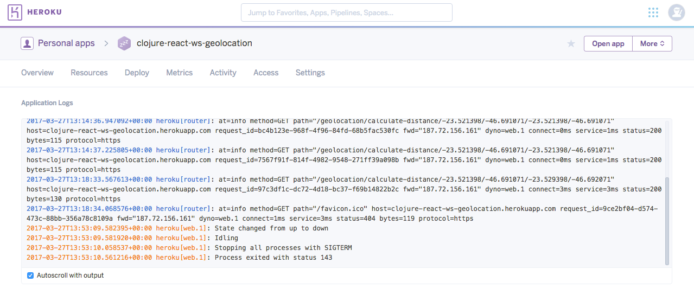

# clojure-websocket-react-geolocation
Esse projeto tem por objetivo demonstrar como construir um *microservice* utilizando **Clojure**
como a linguagem de programação que permite o desenvolvimento baseado no paradigma funcional.

Os dois recursos, inicialmente disponíveis, realizam o cálculo da distância de duas coordenadas geográficas
utilizando a [Fórmula de Haversine](https://pt.wikipedia.org/wiki/F%C3%B3rmula_de_Haversine). 

A idéia foi demonstrar como utilizar o protocolo *Websocket* e o HTTP padrão.

## Motivação ##
O paradigma funcional é algo desafiador para os programadores oriundos de outras técnicas de programção.
Ele trás a necessidade do estudante de pensar por outra prisma, tornando as funcões cidadãs de primeira classe.

Clojure é um dialeto de LISP, então, programadores que já conhecem outras linguagens como [Haskell](https://www.haskell.org/) e
[Erlang](https://www.erlang.org/) vão se sentir mais confortáveis.

Para programadores com larga experiência no mundo Java, o fato de Clojure rodar na JVM, pode ser um fator a mais de atração.

Também, a possibilidade de se construir *microservices* que necessitam de alta performance aliada com baixos investimentos em infra.
Com a Imutabilidade de Clojure isso se torna factível. 

## Setup ##

É necessário os seguintes pré-requisitos para realizar o build & deploy da aplicação:

* [JDK 8+](http://www.oracle.com/technetwork/pt/java/javase/downloads/jdk8-downloads-2133151.html) 
* [Leiningen](https://leiningen.org/)

A sugestão de IDE é o **counterclockwise-0.35.0**, mas sinta-se  à vontade para utilizar outras!

### Test ###
Escrever testes de unidade, integração e funcionais em Clojure é muito simples. Nesse projeto, execute o seguinte comando para validar os testes de unidade:

```
lein test

lein test br.com.reactive-poc.rest-service-test
"Elapsed time: 3.071663 msecs"
{"result":1540.6100747499536}

lein test :only br.com.reactive-poc.rest-service-test/test-request-success

ERROR in (test-request-success) (Numbers.java:227)
Test JSON message request with success
expected: (> result 0.0)
  actual: java.lang.ClassCastException: java.lang.String cannot be cast to java.lang.Number
 at clojure.lang.Numbers.gt (Numbers.java:227)
    clojure.core$_GT_.invoke (core.clj:1036)
    clojure.lang.AFn.applyToHelper (AFn.java:156)
    clojure.lang.RestFn.applyTo (RestFn.java:132)
    clojure.core$apply.invoke (core.clj:624)
    br.com.reactive_poc.rest_service_test/fn (rest_service_test.clj:30)
    clojure.test$test_var$fn__7187.invoke (test.clj:704)
    clojure.test$test_var.invoke (test.clj:704)
    clojure.test$test_vars$fn__7209$fn__7214.invoke (test.clj:722)
    clojure.test$default_fixture.invoke (test.clj:674)
    clojure.test$test_vars$fn__7209.invoke (test.clj:722)
    clojure.test$default_fixture.invoke (test.clj:674)
    clojure.test$test_vars.invoke (test.clj:718)
    clojure.test$test_all_vars.invoke (test.clj:728)
    clojure.test$test_ns.invoke (test.clj:747)
    user$eval85$fn__136.invoke (form-init7361099933128776754.clj:1)
    clojure.lang.AFn.applyToHelper (AFn.java:156)
    clojure.lang.AFn.applyTo (AFn.java:144)
    clojure.core$apply.invoke (core.clj:626)
    leiningen.core.injected$compose_hooks$fn__19.doInvoke (form-init7361099933128776754.clj:1)
    clojure.lang.RestFn.applyTo (RestFn.java:137)
    clojure.core$apply.invoke (core.clj:624)
    leiningen.core.injected$run_hooks.invoke (form-init7361099933128776754.clj:1)
    leiningen.core.injected$prepare_for_hooks$fn__24$fn__25.doInvoke (form-init7361099933128776754.clj:1)
    clojure.lang.RestFn.applyTo (RestFn.java:137)
    clojure.lang.AFunction$1.doInvoke (AFunction.java:29)
    clojure.lang.RestFn.invoke (RestFn.java:408)
    clojure.core$map$fn__4245.invoke (core.clj:2559)
    clojure.lang.LazySeq.sval (LazySeq.java:40)
    clojure.lang.LazySeq.seq (LazySeq.java:49)
    clojure.lang.Cons.next (Cons.java:39)
    clojure.lang.RT.boundedLength (RT.java:1654)
    clojure.lang.RestFn.applyTo (RestFn.java:130)
    clojure.core$apply.invoke (core.clj:626)
    clojure.test$run_tests.doInvoke (test.clj:762)
    clojure.lang.RestFn.applyTo (RestFn.java:137)
    clojure.core$apply.invoke (core.clj:624)
    user$eval85$fn__148$fn__179.invoke (form-init7361099933128776754.clj:1)
    user$eval85$fn__148$fn__149.invoke (form-init7361099933128776754.clj:1)
    user$eval85$fn__148.invoke (form-init7361099933128776754.clj:1)
    user$eval85.invoke (form-init7361099933128776754.clj:1)
    clojure.lang.Compiler.eval (Compiler.java:6703)
    clojure.lang.Compiler.eval (Compiler.java:6693)
    clojure.lang.Compiler.load (Compiler.java:7130)
    clojure.lang.Compiler.loadFile (Compiler.java:7086)
    clojure.main$load_script.invoke (main.clj:274)
    clojure.main$init_opt.invoke (main.clj:279)
    clojure.main$initialize.invoke (main.clj:307)
    clojure.main$null_opt.invoke (main.clj:342)
    clojure.main$main.doInvoke (main.clj:420)
    clojure.lang.RestFn.invoke (RestFn.java:421)
    clojure.lang.Var.invoke (Var.java:383)
    clojure.lang.AFn.applyToHelper (AFn.java:156)
    clojure.lang.Var.applyTo (Var.java:700)
    clojure.main.main (main.java:37)

Ran 4 tests containing 4 assertions.
0 failures, 1 errors.
Tests failed.
```

### Build ####

Uma vez que o *clone* do projeto foi feito em sua máquina, com o devido *setup* realizado, navegue até a raíz do projeto e execute:
```
lein repl

nREPL server started on port 51716 on host 127.0.0.1 - nrepl://127.0.0.1:51716
REPL-y 0.3.7, nREPL 0.2.12
Clojure 1.6.0
Java HotSpot(TM) 64-Bit Server VM 1.8.0_121-b13
    Docs: (doc function-name-here)
          (find-doc "part-of-name-here")
  Source: (source function-name-here)
 Javadoc: (javadoc java-object-or-class-here)
    Exit: Control+D or (exit) or (quit)
 Results: Stored in vars *1, *2, *3, an exception in *e

br.com.reactive-poc.rest-service=>
```
O projeto está pronto para ser executado:

```
lein run

...

14:06:13.195 INFO  [org.xnio] (main) XNIO version 3.3.6.Final
14:06:13.211 INFO  [org.xnio.nio] (main) XNIO NIO Implementation Version 3.3.6.Final
14:06:13.378 INFO  [org.projectodd.wunderboss.web.Web] (main) Registered web context /geolocation/async
14:06:13.384 INFO  [org.projectodd.wunderboss.web.Web] (main) Registered web context /geolocation
```

Para gerar o **.jar** do projeto basta executar o comando abaixo:
```
lein uberjar
...
Compiling br.com.reactive-poc.rest-service
Created /app/src/target/clojure-websocket-react-geolocation-1.0.0-SNAPSHOT.jar
Created /app/src/target/clojure-websocket-react-geolocation-1.0.0-SNAPSHOT-standalone.jar
```

Verifique se o **.jar** criado está funcional:
```
java -jar target/clojure-websocket-react-geolocation-1.0.0-SNAPSHOT-standalone.jar host 0.0.0.0 port 8001
...
14:13:47.171 INFO  [org.xnio] (main) XNIO version 3.3.6.Final
14:13:47.199 INFO  [org.xnio.nio] (main) XNIO NIO Implementation Version 3.3.6.Final
14:13:47.490 INFO  [org.projectodd.wunderboss.web.Web] (main) Registered web context /geolocation/async
14:13:47.494 INFO  [org.projectodd.wunderboss.web.Web] (main) Registered web context /geolocation
```

Utilizando o cURL/WGET, realize um teste do *end-point*:
```
wget "http://localhost:8001/geolocation/calculate-distance/-23.521398/-46.691071/-23.529398/-46.692071"


--2017-03-27 14:16:19--  http://localhost:8001/geolocation/calculate-distance/-23.521398/-46.691071/-23.529398/-46.692071
Resolving localhost (localhost)... 127.0.0.1
Connecting to localhost (localhost)|127.0.0.1|:8001... connected.
HTTP request sent, awaiting response... 200 OK
Length: 17
Saving to: '-46.692071'
```

## DevOps ##

Para acelerar o processo de estudo desse exemplo, disponibilizo um arquivo [Vagrantfile](Vagrantfile) com os recursos necessários para rodar o projeto em uma máquina virtual.

## Cloud Computing ##
A facilidade de criar um aplicativo *Fullstack* ou mesmo um *microservice* em uma nuvem pública hoje é inquestionável.
Muitas *Startups* que começam a entregar soluções de software de maneira ágil e contínua, 
utilizam IAAS/PAAS para começar com uma versão sem custos e ir escalando a medida que a utilização do aplicativo comece a crescer. 

### Heroku ###
Nesse exemplo, hospedamos nosso *microservice* no [Heroku](https://devcenter.heroku.com/articles/using-websockets-on-heroku-with-clojure-and-immutant) pra realizarmos testes de unidade e de performance.

Nesse [material](https://devcenter.heroku.com/start), é possível entender como começar com uma versão free no Heroku.

Para realizar o deploy no serviço de PAAS do Heroku, é necessário criar o seguinte arquivo [Procfile](Procfile).

O deploy foi feito utilizando a estrutura do GitHub hospedada no Heroku, o que permite criar técnicas de *Delivery Continuous*.
